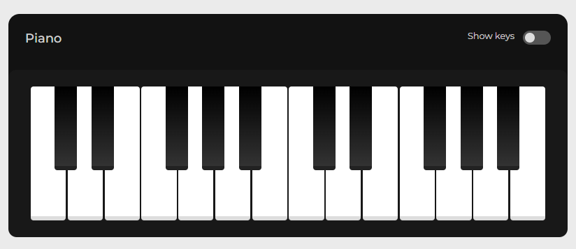
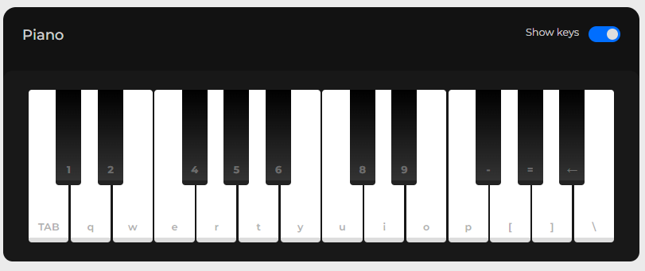

# Piano

Projeto feito na criação de um piano que possa ser tocado tanto pelo teclado, quanto pelo mouse.

Foi muito interessante poder estudar tanto, CSS quanto JavaScript e testar meus conhecimentos de manipulação da DOM.

## Stack utilizada

**Front-end:** HTML, CSS, JavaScript

## Screenshots

